# SAAS FOOD MENU

## ABOUT

A website that allows culinary business owners to create professional online menus. Each shop can display their menu via a unique link or QR Code. This system supports multiple stores, menu categories, menu images and subscription features for stores with advanced needs.

## FEATURES

### Sales

**Login Dashboard**

- Access the admin dashboard to manage store and user data.

**Content Management System**

- Dashboard area to view important statistics and data.
  - Manage store data (store name, description, logo).
  - Manage menu category data (category specific to each store).
- Manage menu data:
  - Add/edit/delete menus.
  - Add more images for one menu.
- Manage users and subscriptions.
- Track payment status subscription (integration with
  Midtrans).

### Admin

- Registration & Login
  Shop owners can register shops them through a special page.
- Store Management
  - Editing shop profile (name, description, logo, QR code).
  - Added new menu with categories and supporting images.
  - View store statistics such as quantities visit or menu download.
- Subscription feature
  - Free for the first 10 menus.
  - Premium subscription for a fee IDR 50,000 per month for add more than 10 menus.
  - Status update notifications subscriber.

## Technical Design

- Bcrypt to hash user passwords
- Midtrans for payment
- Public Facing: Astro
- Dashboard: Vite React
- RestfulAPI: NestJs
- Using Feature-Based Architecture for the frontend
- Using Modular-Design Architecture for the backend
- Database: PostgreSQL

## Architecture Design

### Astro

Feature-Based Architecture:

<pre>
.
├── public
├── src/
│ ├── assets/
│ │ ├── styles/
│ │ │ └── global.css
│ │ ├── images
│ │ ├── icons
│ │ └── fonts
│ ├── components/
│ │ └── ui/
│ │ ├── button.tsx
│ │ └── dropdown.tsx
│ ├── layouts/
│ │ └── layout-a.astro
│ ├── pages/
│ │ ├── index.astro
│ │ └── home/
│ │ └── index.astro
│ ├── shared/
│ │ ├── constants
│ │ ├── libs
│ │ └── types
│ └── views/
│ ├── home/
│ │ ├── components
│ │ ├── services
│ │ ├── types
│ │ └── utils
│ ├── category
│ └── profile
├── .gitignore
├── astro.config.mjs
├── package-lock.json
├── package.json
├── [README.md]
└── tsconfig.json
</pre>

### VITE REACT

Feature-Based Architecture:

<pre>
.
├── public
├── src/
│ ├── assets/
│ │ ├── styles/
│ │ │ └── global.css
│ │ ├── images
│ │ ├── icons
│ │ └── fonts
│ ├── components/
│ │ └── ui/
│ │ ├── button.tsx
│ │ └── dropdown.tsx
│ ├── layouts/
│ │ └── layout-a.tsx
│ ├── pages/
│ │ ├── index.tsx
│ │ └── home/
│ │ └── index.tsx
│ ├── shared/
│ │ ├── constants
│ │ ├── libs
│ │ └── types
│ └── views/
│ ├── home/
│ │ ├── components
│ │ ├── services
│ │ ├── types
│ │ └── utils
│ ├── category
│ └── profile
├── .gitignore
├── vite.config.mjs
├── package-lock.json
├── package.json
├── [README.md]
└── tsconfig.json
</pre>

### NestJs

Modular-Design Architecture:

<pre>
.
├── node_modules
├── src/
│ ├── app/
│ │ ├── configs/
│ │ │ ├── env.config.ts
│ │ │ ├── rabbitmq.config.ts
│ │ │ └── redis.config.ts
│ │ ├── handlers/
│ │ │ └── handle-error.ts
│ │ ├── producers
│ │ ├── index.ts
│ │ └── server.ts
│ ├── database/
│ │ └── migrations
│ ├── modules/
│ │ ├── auth/
│ │ │ ├── application/
│ │ │ │ ├── dtos
│ │ │ │ ├── schemas
│ │ │ │ └── use-cases
│ │ │ ├── domain/
│ │ │ │ ├── entities
│ │ │ │ └── value-objects
│ │ │ ├── infrastructure/
│ │ │ │ ├── mappers
│ │ │ │ ├── plugins
│ │ │ │ └── repositories
│ │ │ └── interface/
│ │ │ ├── http
│ │ │ └── validators
│ │ └── user
│ └── shared/
│ ├── constants
│ ├── domains
│ ├── errors
│ ├── libs
│ ├── types
│ └── utils
├── .env
├── .gitignore
├── .prettierrc
├── package.json
└── tsconfig.json
</pre>

## Pages Routing

- **ASTRO - Public Facing Pages**
  - /
  - /[store_name]
  - /[store_name]/search
  - /[store_name]/products
  - /[store_name]/products?limit=?&page=?search=?&category=?
  - /[store_name]/preducts/[slug]/details
  - /[store_name]/charts
  - /[store_name]/transactions
  - /[store_name]/transactions/:id/details
  - /[store_name]/profile
- **VITE REACT - CMS Pages**
  - Authentication
    - /auth/signin
    - /auth/signup
  - Dashboard
    - /dashboard
  - Management Subscriptions
    - /subscriptions
    - /subscriptions/create
    - /subscriptions/edit
  - Management Transactions
    - /transactions
    - /transactions/create
    - /transactions/edit
  - Management Users
    - /users
    - /users/create
    - /users/edit
  - Management Categories
    - /categories
    - /categories/create
    - /categories/edit
  - Management Products
    - /products
    - /products/create
    - /products/edit
  - Management Bank
    - /banks
    - /banks/create
    - /banks/edit
  - Settings
    - /stores
    - /stores/create
    - /stores/edit
    - /stores/details

## API Spec

### ERD

```mermaid
erDiagram
  direction LR

  STORES {
    string(12) id PK
    string(100) name
    string(255) image
    string(255) slug
    string(50) phone
    text location
    text description
    string(100) status
    date created_at "default now"
    date updated_at "default now"
    string(12) created_by FK
    string(12) updated_by FK
  }

  USERS {
    string(12) id PK
    string(12) store_id
    string(255) avatar "nullable"
    string(50) full_name
    string(50) username
    string(100) email
    string(50) phone
    string(100) password
    date last_login
    date created_at
    date updated_at
    string(12) created_by FK
    string(12) updated_by FK
  }

  ROLES {
    string(12) id PK
    string(100) name
    string(255) description "optional"
    date created_at "default now"
    date updated_at "default now"
    string(12) created_by FK
    string(12) updated_by FK
  }

  PERMISSIONS {
    string(12) id PK
    string(100) name
    string(100) action
    string(100) subject
    string(100) conditions "optional"
    boolean inverted
    string(255) reason "optional"
    date created_at "default now"
    date updated_at "default now"
    string(12) created_by FK
    string(12) updated_by FK
  }

  USER_ROLES {
    string(12) id PK
    string(12) user_id FK
    string(12) role_id FK
    date created_at "default now"
    date updated_at "default now"
    string(12) created_by FK
    string(12) updated_by FK
  }

  ROLE_PERMISSIONS {
    string(12) id PK
    string(12) role_id FK
    string(12) permission_id FK
    date created_at "default now"
    date updated_at "default now"
    string(12) created_by FK
    string(12) updated_by FK
  }

  BANKS {
    string(12) id PK
    string(12) store_id FK
    string(100) account
    string(100) name
    string(100) number
    date created_at "default now"
    date updated_at "default now"
    string(12) created_by FK
    string(12) updated_by FK
  }

  SUBSCRIPTIONS {
    string(12) id PK
    string(12) store_id FK
    string(12) user_id FK
    string(100) status
    date start_date
    date end_date
    date created_at "default now"
    date updated_at "default now"
    string(12) created_by FK
    string(12) updated_by FK
  }

  SUBSCRIPTION_PAYMENTS {
    string(12) id PK
    string(12) subscription_id FK
    string(100) payment_method
    string(255) proof
    string(100) bank_account
    string(100) bank_name
    string(100) bank_number
    date created_at "default now"
    date updated_at "default now"
    string(12) created_by FK
    string(12) updated_by FK
  }

  CATEGORIES {
    string(12) id PK
    string(12) store_id FK
    string(255) name
    string(255) slug
    string(255) image
    date created_at "default now"
    date updated_at "default now"
    string(12) created_by FK
    string(12) updated_by FK
  }

  PRODUCTS {
    string(12) id PK
    string(12) store_id FK
    string(255) name
    string(255) slug
    string(255) image
    text description
    decimal price
    date created_at "default now"
    date updated_at "default now"
    string(12) created_by FK
    string(12) updated_by FK
  }

  PRODUCT_CATEGORIES {
    string(12) id PK
    string(12) product_id FK
    string(12) category_id FK
    date created_at "default now"
    date updated_at "default now"
    string(12) created_by FK
    string(12) updated_by FK
  }

  MENU_INGREDIENTS {
    string(12) id PK
    string(12) store_id FK
    string(12) product_id FK
    string(100) name
    date created_at "default now"
    date updated_at "default now"
    string(12) created_by FK
    string(12) updated_by FK
  }

  TRANSACTIONS {
    string(12) id PK
    string(12) store_id FK
    string(100) code
    string(100) name
    string(100) table_number
    string(100) payment_method
    decimal total_price
    string(100) status
    date created_at "default now"
    date updated_at "default now"
    string(12) created_by FK
    string(12) updated_by FK
  }

  TRANSACTION_DETAILS {
    string(12) id PK
    string(12) transaction_id FK
    string(12) product_id FK
    int quantity
    string(255) note
    date created_at "default now"
    date updated_at "default now"
    string(12) created_by FK
    string(12) updated_by FK
  }

  STORES ||--o{ USERS : "one-to-many"
  STORES ||--o{ SUBSCRIPTIONS : "one-to-many"
  STORES ||--o{ BANKS : "one-to-many"
  STORES ||--o{ CATEGORIES : "one-to-many"
  STORES ||--o{ PRODUCTS : "one-to-many"
  STORES ||--o{ TRANSACTIONS : "one-to-many"
  STORES ||--o{ MENU_INGREDIENTS: "one-to-many"

  USERS ||--o{ USER_ROLES : "one-to-many"
  ROLES ||--o{ USER_ROLES : "one-to-many"
  ROLES ||--o{ ROLE_PERMISSIONS : "one-to-many"
  PERMISSIONS ||--o{ ROLE_PERMISSIONS : "one-to-many"

  USERS ||--o{ SUBSCRIPTIONS : "one-to-many"
  SUBSCRIPTIONS ||--o{ SUBSCRIPTION_PAYMENTS: "one-to-many"
  TRANSACTIONS ||--o{ TRANSACTION_DETAILS: "one-to-many"

  PRODUCTS ||--o{ PRODUCT_CATEGORIES: "one-to-many"
  CATEGORIES ||--o{ PRODUCT_CATEGORIES: "one-to-many"
  PRODUCTS ||--o{ MENU_INGREDIENTS: "one-to-many"

  PRODUCTS ||--o{ TRANSACTION_DETAILS: "one-to-many"

  USERS ||--o{ STORES : "one-to-many (creator/updater)"
  USERS ||--o{ ROLES : "one-to-many (creator/updater)"
  USERS ||--o{ PERMISSIONS : "one-to-many (creator/updater)"
  USERS ||--o{ USER_ROLES : "one-to-many (creator/updater)"
  USERS ||--o{ ROLE_PERMISSIONS : "one-to-many (creator/updater)"
  USERS ||--o{ BANKS : "one-to-many (creator/updater)"
  USERS ||--o{ SUBSCRIPTIONS : "one-to-many (creator/updater)"
  USERS ||--o{ SUBSCRIPTION_PAYMENTS : "one-to-many (creator/updater)"
  USERS ||--o{ CATEGORIES : "one-to-many (creator/updater)"
  USERS ||--o{ PRODUCTS : "one-to-many (creator/updater)"
  USERS ||--o{ PRODUCT_CATEGORIES : "one-to-many (creator/updater)"
  USERS ||--o{ TRANSACTIONS : "one-to-many (creator/updater)"
  USERS ||--o{ TRANSACTION_DETAILS : "one-to-many (creator/updater)"
  USERS ||--o{ MENU_INGREDIENTS : "one-to-many (creator/updater)"

```

### API Endpoint

**Pages** - Backend For Frontend (BFF) - [**API-Spec**](/server/src/modules/page/application/docs/page-api.md)

- `GET /api/v1/pages/home` - Retrieve all data for home page
- `GET /api/v1/pages/products?limit=?&page=?&search=?&category` - Search all products filtered by search key and category name
- `GET /api/v1/pages/search` - Retrieve all categories to search product by name and category
- `GET /api/v1/pages/products/:id/details` - Retrieve details product by id (also get menu ingredients of product)
- `POST /api/v1/pages/transactions` - Create new transaction (don't post the price, let backend handle it)
- `GET /api/v1/pages/transactions/:id/details` - Retrieve new created transaction details by id

**Authentication** - [**API-Spec**](/server/src/modules/authentication/application/docs/authentication-api.md)

- `POST /api/v1/auth/signup` - Register as a user
- `POST /api/v1/auth/signin` - Login as a user

**User** - [**API-Spec**](/server/src/modules/user/application/docs/user-api.md)

- `GET /api/v1/users?limit=?&page?&search=?` - Retrieve users data with pagination
- `POST /api/v1/users` - Create new user
- `GET /api/v1/users/:id` - Get user data by id
- `PUT /api/v1/users/:id` - Update user data by id
- `DELETE /api/v1/users/:id` - Delete user by id

**Store** - [**API-Spec**](/server/src/modules/store/application/docs/store-api.md)

- `GET /api/v1/stores?limit=?&page?&search=?` - Retrieve stores data with pagination
- `POST /api/v1/stores` - Create new store
- `GET /api/v1/stores/:id` - Get store data by id
- `PUT /api/v1/stores/:id` - Update store data by id
- `DELETE /api/v1/stores/:id` - Delete store by id

**Subscription** - [**API-Spec**](/server/src/modules/subscription/application/docs/subscription-api.md)

- `GET /api/v1/subscriptions?limit=?&page?&search=?` - Retrieve subscriptions data with pagination
- `POST /api/v1/subscriptions` - Create new subscription
- `GET /api/v1/subscriptions/:id` - Get subscription data by id
- `PUT /api/v1/subscriptions/:id` - Update subscription data by id
- `DELETE /api/v1/subscriptions/:id` - Delete subscription by id

**Category** - [**API-Spec**](/server/src/modules/category/application/docs/category-api.md)

- `GET /api/v1/categories?limit=?&page?&search=?` - Retrieve categories data with pagination
- `POST /api/v1/categories` - Create new category
- `GET /api/v1/categories/:id` - Get category data by id
- `PUT /api/v1/categories/:id` - Update category data by id
- `DELETE /api/v1/categories/:id` - Delete category by id

**Product** - [**API-Spec**](/server/src/modules/product/application/docs/product-api.md)

- `GET /api/v1/products?limit=?&page?&search=?` - Retrieve products data with pagination
- `POST /api/v1/products` - Create new product
- `GET /api/v1/products/:id` - Get product data by id
- `PUT /api/v1/products/:id` - Update product data by id
- `DELETE /api/v1/products/:id` - Delete product by id

**Transaction** - [**API-Spec**](/server/src/modules/transaction/application/docs/transaction-api.md)

- `GET /api/v1/transactions?limit=?&page?&search=?` - Retrieve transactions data with pagination
- `POST /api/v1/transactions` - Create new transaction
- `GET /api/v1/transactions/:id` - Get transaction data by id
- `PUT /api/v1/transactions/:id` - Update transaction data by id
- `DELETE /api/v1/transactions/:id` - Delete transaction by id
